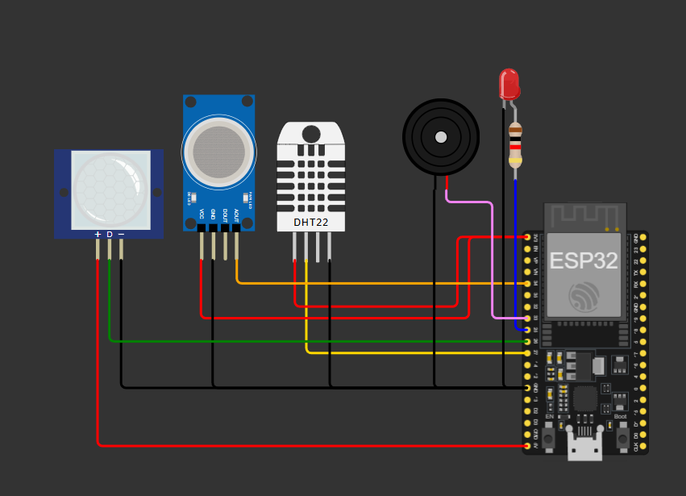
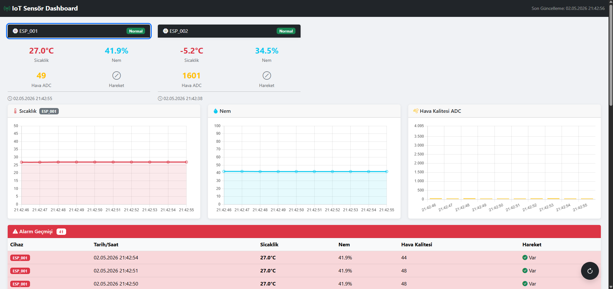
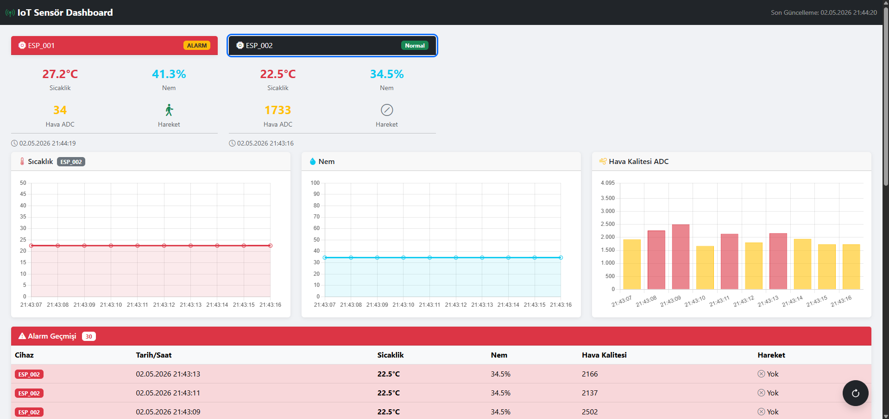

# Smart Environmental Monitoring & Alert System

Gerçek zamanlı çevre izleme sistemi. ESP32 tabanlı donanım sensör verilerini (sıcaklık, nem, hava kalitesi, hareket) MQTT üzerinden bir .NET Web API'ye iletir; veriler PostgreSQL'de saklanır.

---

## Mimari

```
[ESP32 + Sensörler] ──MQTT──► [.NET Web API] ──► [PostgreSQL]
```

| Katman     | Teknoloji                            |
|------------|--------------------------------------|
| Gömülü     | ESP32, Arduino/PlatformIO, C++       |
| Backend    | .NET 10, ASP.NET Core, EF Core       |
| Veritabanı | PostgreSQL                           |
| Mesajlaşma | MQTT (EMQX Cloud — TLS/8883)         |

---

## Gereksinimler

### Backend

| Araç | Minimum Sürüm | İndirme |
|------|---------------|---------|
| .NET SDK | 10.0 | https://dotnet.microsoft.com/download |
| PostgreSQL | 14+ | https://www.postgresql.org/download |

> MQTT broker olarak [EMQX Cloud](https://www.emqx.com/en/cloud) kullanılmaktadır. Herhangi bir broker kurulumuna gerek yoktur; yalnızca `.env` dosyasındaki bağlantı bilgilerinin doğru girilmesi yeterlidir.

### Embedded (ESP32 Firmware)

| Araç | Minimum Sürüm | İndirme |
|------|---------------|---------|
| Python | 3.8+ | https://www.python.org/downloads |
| PlatformIO CLI veya IDE | latest | https://platformio.org/install |

> PlatformIO, kütüphaneleri (`DHT sensor library`, `PubSubClient`, vb.) ilk build sırasında otomatik olarak indirir.

---

## Kurulum

### 1. Repo klonlanır

```bash
git clone <repo-url>
cd SmartEnviromentalMonitoringAlertSystem
```

---

### 2. MQTT Broker

Bu proje MQTT broker olarak [EMQX Cloud](https://www.emqx.com/en/cloud) kullanmaktadır. Kurulum gerektirmez; backend ve ESP32 `.env` dosyalarına broker bilgileri girilmesi yeterlidir.

EMQX Cloud'da yeni bir deployment oluşturduktan sonra:
- **Host:** Deployment sayfasındaki bağlantı adresi
- **Port:** `8883` (TLS zorunludur)
- **Kullanıcı adı / şifre:** EMQX Cloud konsolundan oluşturulan kimlik bilgileri

---

### 3. Backend kurulumu

#### 3.1 Ortam değişkenlerinin ayarlanması

```bash
cd Backend/iotAPI
cp .env.example .env
```

`.env` dosyası açılarak aşağıdaki değerlerin doldurulması gerekir:

```env
# PostgreSQL bağlantısı
ConnectionStrings__PostgreSQL=Host=localhost;Port=5432;Database=iotdb;Username=postgres;Password=sifreniz

# MQTT broker (EMQX Cloud)
MqttConfiguration__Host=your-cluster.emqxsl.com
MqttConfiguration__Port=8883
MqttConfiguration__ClientId=iotAPI
MqttConfiguration__Topic=sensors
MqttConfiguration__UseTls=true
MqttConfiguration__Username=kullanici_adiniz
MqttConfiguration__Password=sifreniz
```

#### 3.2 Bağımlılıkları yükle, derle ve çalıştır

```bash
dotnet restore
dotnet build
dotnet run
```

Uygulama ilk çalıştığında EF Core, veritabanını ve tabloları otomatik olarak oluşturur (`EnsureCreatedAsync`).

---

### 4. Embedded (ESP32) kurulumu

#### 4.1 Ortam değişkenlerinin ayarlanması

```bash
cd Embedded
cp .env.example .env
```

`.env` dosyası açılarak aşağıdaki değerlerin doldurulması gerekir:

```env
DEVICE_ID=ESP_001
WIFI_SSID=ağ_adın
WIFI_PASSWORD=şifren
MQTT_BROKER=your-cluster.emqxsl.com
MQTT_PORT=8883
MQTT_CLIENT_ID=001
MQTT_TOPIC=sensors
MQTT_USER=kullanici_adiniz
MQTT_PASS=sifreniz
```

> `MQTT_BROKER`, `MQTT_USER` ve `MQTT_PASS` değerleri EMQX Cloud konsolundan alınmalıdır. ESP32 broker'a TLS (`WiFiClientSecure`) üzerinden bağlanır; sertifika doğrulaması yapılmaz (`setInsecure`).

#### 4.2 Firmware yüklenmesi

> `pio` komutunun terminalde tanınması için PlatformIO'nun PATH'te olması gerekir. `pip install platformio` ile kurulum yapıldıysa otomatik eklenir. VS Code extension üzerinden kurulmuşsa `~\.platformio\penv\Scripts` dizininin manuel olarak PATH'e eklenmesi gerekebilir. VS Code PlatformIO extension kullanılıyorsa terminal komutuna gerek yoktur — alt toolbar'daki **Upload** butonu aynı işlemi gerçekleştirir.

```bash
# Bağımlılıkları yükle ve derle
pio run

# ESP32'yi USB ile bağla, ardından yükle
pio run --target upload
```

---

## Bağlantı Şeması



| Sensör / Bileşen      | ESP32 Pin     |
|-----------------------|---------------|
| DHT11 (sıcaklık/nem)  | GPIO 27       |
| PIR (hareket)         | GPIO 26       |
| MQ135 (hava kalitesi) | GPIO 32 (ADC) |
| LED                   | GPIO 25       |
| Buzzer                | GPIO 33       |

---

## Kullanım (Usage)

### Nasıl Çalıştırılır ve Gözlemlenir

Sistem çalışır duruma geldikten sonra aşağıdaki adımlarla doğrulanabilir:

**1. Backend erişimi**

`Backend/iotAPI` dizininde `dotnet run` komutu çalıştırılır, ardından `http://localhost:5011` adresinden dashboard'a erişilebilir.

**2. ESP32'ye firmware yükleme**

`Embedded` dizininde aşağıdaki komutla kod ESP32'ye yüklenir:

```bash
pio run --target upload
```

**2. API endpoint'leri**

| Method | Endpoint | Açıklama |
|--------|----------|----------|
| GET | `/api/sensordata/latest` | Tüm cihazların en son okumasını getirir |
| GET | `/api/sensordata/recent/{deviceId}?limit=10` | Belirli bir cihazın son N kaydını getirir |
| GET | `/api/sensordata/alerts?limit=20` | Alarm tetiklenmiş kayıtları listeler |

---

### Teknik Tercihler ve Akış

**Embedded — Veri Üretimi**

ESP32 üzerinde iki FreeRTOS görevi paralel olarak çalışır ve her biri ayrı bir çekirdeğe sabitlenmiştir:

- **`taskSensors` (Core 1):** DHT11'i 2.5 saniyede bir, PIR ve MQ135'i 100 ms'de bir okur. Eşik değerleri aşıldığında LED ve buzzer'ı tetikler. Okunan veriler paylaşımlı bir alana mutex korumasıyla yazılır.
- **`taskMqtt` (Core 0):** Her 1 saniyede paylaşımlı alandan son okumayı alır, JSON paketi oluşturur ve MQTT broker'a gönderir.

İki görevin ayrı çekirdeklerde çalışması sayesinde veri okuma ve veri gönderme işlemleri birbirinden izole edilmiştir.

Gönderilecek paketin JSON formatı:

```json
{
  "device_id": "ESP_001",
  "timestamp": "2026-05-02T10:30:00Z",
  "temperature": 24.5,
  "humidity": 58.0,
  "air_adc": 310,
  "motion": false,
  "alert": false
}
```

Bağlantı kesildiğinde paketler bellekte (en fazla 30 adet) tutulur; bağlantı yeniden kurulunca sırayla gönderilir.

---

**Backend — Veri Alımı ve Depolama**

- `MqttListenerService` uygulama başladığında broker'a bağlanır ve `sensors` topic'ine subscribe olur.
- Her gelen mesaj `MqttMessageHandler`'a iletilir; JSON deserialize edilerek `SensorReading` modeline dönüştürülür.
- `SensorDataRepository` aracılığıyla PostgreSQL'e yazılır. `alertActive` alanı `true` ise kayıt alarm olarak işaretlenir.
- EF Core şemayı ilk çalıştırmada otomatik oluşturur; migration yönetimi gerekmez.

---

**Genel Akış**

DHT11, PIR ve MQ135 sensörlerinden okunan veriler ESP32 üzerinde işlenir. FreeRTOS'un dual-core yapısı sayesinde **Core 1** sensör okuma ve uyarı çıkışlarını (LED/Buzzer) yönetirken **Core 0** (WiFi yığınıyla aynı çekirdek) her saniye JSON paketini EMQX Cloud broker'a TLS üzerinden publish eder. Backend'deki `MqttListenerService` bu paketi alır, `MqttMessageHandler` aracılığıyla ayrıştırır ve `SensorDataRepository` ile PostgreSQL'e yazar. Dışarıya ise `/api/sensordata/latest`, `/api/sensordata/recent/{deviceId}` ve `/api/sensordata/alerts` endpoint'leri üzerinden REST API olarak sunulur.

**Tercih gerekçeleri:**

| Tercih | Gerekçe |
|--------|---------|
| MQTT | Düşük bant genişliği, pub/sub modeli IoT için idealdir |
| FreeRTOS dual-core | Sensör okuma ve ağ iletişimi ayrı çekirdeklerde çalışır; biri diğerini yavaşlatmaz |
| EF Core `EnsureCreatedAsync` | Geliştirme ortamında migration yönetimi olmadan hızlı schema oluşturur |
| `.env` tabanlı config | Gizli bilgiler (şifre, SSID) kaynak koddan ve repo'dan ayrı tutulur |

---

## Dashboard Ekran Görüntüleri

Aşağıdaki görüntüler iki cihazın aynı anda bağlı olduğu durumu göstermektedir. **ESP_001** fiziksel olarak kurulu devredir. **ESP_002** Wokwi üzerinde çalışan simülasyon cihazıdır; test ve geliştirme amacıyla tasarlanmıştır. Bir cihaz kartına tıklandığında grafikler ve alarm geçmişi o cihaza göre güncellenir.

**ESP_001**


**ESP_002**

